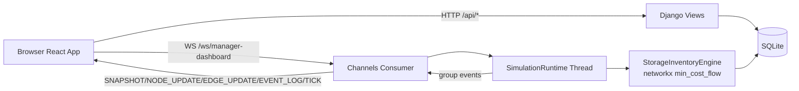

# Hackath0n: Transportation Management System

Технічна документація до проєкту (Django + Channels + React Flow), який моделює перерозподіл запасів між складами та магазинами в реальному часі.

---

## Зміст

1. [Огляд системи](#огляд-системи)
2. [Технологічний стек](#технологічний-стек)
3. [Архітектура](#архітектура)
4. [Структура репозиторію](#структура-репозиторію)
5. [Доменна модель і БД](#доменна-модель-і-бд)
6. [Життєвий цикл мережі (import JSON -> акаунти -> маршрути)](#життєвий-цикл-мережі-import-json---акаунти---маршрути)
7. [Симуляція: тики, маршрути, алгоритм оптимізації](#симуляція-тики-маршрути-алгоритм-оптимізації)
8. [Realtime-протокол WebSocket](#realtime-протокол-websocket)
9. [REST API](#rest-api)
10. [Frontend-архітектура](#frontend-архітектура)
11. [Конфігурація через env](#конфігурація-через-env)
12. [Usage](#usage)
14. [Тести і валідація](#тести-і-валідація)

---

## Огляд системи

Система призначена для:

- керування запасами в мережі `warehouse`/`shop`
- автоматичного планування поставок на кожному тіку
- візуалізації стану мережі та руху поставок у реальному часі
- редагування параметрів попиту/цілей/запасів із UI

Ключові режими роботи:

- `Manager`:
  - бачить граф мережі
  - отримує realtime-оновлення (`NODE_UPDATE`, `EDGE_UPDATE`, `EVENT_LOG`, `TICK`)
  - редагує метрики вузлів через Details Panel
- `Shop worker`:
  - бачить свій магазин
  - задає `target` і `demandRate`
  - впливає на вхідні параметри симуляції

---

## Технологічний стек

### Backend

- Python 3.x
- Django 6.0.3
- Django Channels 4.x
- Daphne 4.x
- networkx 3.5 (min-cost-flow)
- sqlite3 (за замовчуванням)

### Frontend

- React 19
- Vite 8
- @xyflow/react (React Flow)

### Realtime

- WebSocket endpoint через Channels
- InMemoryChannelLayer (dev-default)

---

## Архітектура



Архітектурні принципи:

- Джерело істини для стану запасів: БД + in-memory engine (із синхронізацією щотіку)
- UI отримує початковий `SNAPSHOT`, далі лише дельти
- Симуляція працює тік-циклом, незалежно від наявності поставок

---

## Структура репозиторію

```text
backend/
  manage.py
  requirements.txt
  algo.py                            # StorageInventoryEngine
  config/
    settings.py                      # env, channels, simulation tuning
    asgi.py                          # ProtocolTypeRouter + websocket routing
    urls.py
  api/
    models.py                        # NetworkDefinition, Warehouse, Shop, Route...
    views.py                         # REST API
    consumers.py                     # WS consumer + snapshot
    realtime.py                      # broadcast helpers + edge state cache
    simulation.py                    # tick runtime, broadcasts, DB sync
    json_parser.py                   # parsing network JSON
    store_account_service.py         # account/route provisioning
    user_roles.py                    # role persistence in auth_user.role
    routing.py                       # ws url patterns
    signals.py                       # post_save(NetworkDefinition)
    tests.py                         # backend test suite
    management/commands/run_simulation.py
frontend/
  package.json
  vite.config.js
  src/
    App.jsx
    context/AuthContext.jsx
    pages/
      MainPage.jsx                   # manager shell + Event/Details panels
      Dashboard.jsx                  # graph + websocket client
      StoreView.jsx                  # shop controls
      LoginPage.jsx
    components/
      GraphMap.jsx
      MovingTruckEdge.jsx            # custom edge animation
      DetailsPanel.jsx
      LoginForm.jsx
```

---

## Доменна модель і БД

### Основні сутності

- `NetworkDefinition`
  - ім'я мережі
  - JSON-файл мережі
  - parsed definition (`JSONField`)
  - `shared_password`
  - `is_active`
- `Warehouse`
  - `node_id`, `name`, `inventory`
  - прив'язка до `User` (one-to-one)
- `Shop`
  - `node_id`, `name`, `inventory`
  - `target`, `demand_rate`
  - прив'язка до `User`
- `Route`
  - `source_node_id`, `target_node_id`
  - `travel_time` (у тіках)
  - `transport_cost`
  - `metadata` (може містити `distance` та інші поля)
  - `edge_id`

### Ролі користувачів

Ролі зберігаються в колонці `auth_user.role` (додана SQL-міграцією):

- `manager`
- `warehouse_worker`
- `shop_worker`

Особливість: роль не через Django Groups, а через прямий колонковий підхід.

---

## Життєвий цикл мережі (import JSON -> акаунти -> маршрути)

1. Адміністратор створює/оновлює `NetworkDefinition` у Django admin.
2. `post_save` сигнал (`api/signals.py`) парсить JSON.
3. `StoreAccountService.create_accounts_from_json(...)`:
   - видаляє старі вузли/акаунти для цієї мережі
   - створює `User` + `Warehouse`/`Shop`
   - призначає ролі
   - зберігає маршрути в `Route`
4. Для `Shop` при ініціалізації:
   - `target = 0`
   - `demand_rate = 0`
   - ці значення має задавати shop-worker через UI

### Формат вхідного JSON мережі

Мінімальна структура:

```json
{
  "name": "Distribution Network",
  "warehouses": [
    {"id": "warehouse_a", "name": "Warehouse A", "inventory": 500, "position": {"x": 120, "y": 0}}
  ],
  "shops": [
    {"id": "shop_a", "name": "Shop A", "inventory": 50, "position": {"x": 120, "y": 220}}
  ],
  "routes": [
    {"from": "warehouse_a", "to": "shop_a", "distance": 2.2, "time": 1, "cost": 3.5}
  ]
}
```

Примітка по часу маршруту:

- якщо є `distance`: `travel_time = ceil(distance)`
- інакше: `travel_time = ceil(time)`
- мінімум: `1`

---

## Симуляція: тики, маршрути, алгоритм оптимізації

### Семантика часу

- 1 тік = `SIMULATION_TICK_SECONDS` секунд (default: `1`)
- час проходження ребра в тіках:
  - `ceil(distance)` якщо `distance` задано
  - інакше `ceil(time)`
- анімація ребра в UI триває рівно `travel_time * SIMULATION_TICK_SECONDS`

### Автозапуск runtime

`ApiConfig.ready()` запускає `start_simulation_thread()` якщо:

- `SIMULATION_AUTOSTART=1`
- процес: `runserver`, `daphne` або `uvicorn`
- для `runserver` враховується `RUN_MAIN=true`, щоб уникнути дублювання потоку

### Tick-цикл `SimulationRuntime.tick_once()`

На кожному тіку:

1. Вибір активної мережі (`is_active=True`, fallback: перша)
2. Зчитування `Warehouse`, `Shop`, `Route`
3. Ребілд engine при зміні мережі/updated_at
4. Синхронізація запасів із БД в engine
5. Оновлення `demand_rate`/`targets` із shop-таблиці
6. `engine.step(tick, targets)`
7. Persist нових запасів у БД
8. Broadcast:
   - `NODE_UPDATE` для змінених/дотичних вузлів
   - `EVENT_LOG` для відправок
   - `EDGE_UPDATE` з активністю ребер
   - `TICK` heartbeat

### Алгоритм `StorageInventoryEngine`

Основа: **time-expanded directed graph** + `networkx.min_cost_flow`.

Ключові механіки:

- `_consume`: попит списує запас до планування
- forecast target для shop:
  - `forecast_target = target + demand_rate * horizon`
- резервування локального запасу/товару в дорозі під власну forecast-ціль
- транспортне ребро має capacity:
  - `vehicle_cap * max_trucks_per_route_tick`
- сформований flow на `t=0` розбивається на Shipment-и не більше `vehicle_cap`

Це дозволяє:

- одночасно запускати кілька вантажівок на ребрі за тік
- робити проактивне поповнення
- не втрачати реалістичність по часу прибуття

### Двосторонні маршрути

Якщо `SIMULATION_ROUTES_BIDIRECTIONAL=1`:

- runtime додає synthetic reverse-route, якщо зворотного ребра немає
- snapshot/layout також віддзеркалюють reverse-edges

---

## Realtime-протокол WebSocket

Endpoint:

- `ws://<host>/ws/manager-dashboard/`

Група:

- `manager-dashboard`

### Події

#### `SNAPSHOT`

Початковий стан після підключення:

```json
{
  "type": "SNAPSHOT",
  "payload": {
    "nodes": [...],
    "edges": [...],
    "layoutName": "..."
  }
}
```

#### `NODE_UPDATE`

```json
{
  "type": "NODE_UPDATE",
  "payload": {
    "id": "shop_a",
    "data": {
      "inventory": 120,
      "target": 180,
      "demandRate": 8
    }
  }
}
```

#### `EDGE_UPDATE`

```json
{
  "type": "EDGE_UPDATE",
  "payload": {
    "id": "edge-warehouse_a-shop_a-1",
    "data": {
      "status": "moving",
      "activeShipments": 2,
      "departureCount": 1,
      "arrivalCount": 0,
      "duration": "3.00s",
      "updatedAt": "2026-04-06T10:10:10.000000+00:00"
    }
  }
}
```

Пояснення:

- `activeShipments`: поточна кількість вантажівок на ребрі
- `departureCount`: скільки стартувало цього тіку
- `arrivalCount`: скільки завершило цього тіку
- `duration`: тривалість проходження ребра для UI-анімації

#### `EVENT_LOG`

```json
{
  "type": "EVENT_LOG",
  "payload": {
    "event": "truck_departure",
    "tick": 42,
    "at": "2026-04-06T10:10:10.000000+00:00",
    "message": "Truck departed: Warehouse A -> Shop A (100 units)",
    "shipment": {
      "fromNodeId": "warehouse_a",
      "toNodeId": "shop_a",
      "amount": 100,
      "departureTick": 42,
      "arrivalTick": 45,
      "edgeId": "edge-warehouse_a-shop_a-1",
      "totalCost": 350
    }
  }
}
```

#### `TICK`

```json
{
  "type": "TICK",
  "payload": {
    "tick": 42,
    "at": "2026-04-06T10:10:10.000000+00:00"
  }
}
```

Потрібен для heartbeat UI (лічильник тіків оновлюється щосекунди, навіть без поставок).

---

## REST API

Базовий префікс: `/api`

### Health

- `GET /api/hello/`

### Auth (session + CSRF)

- `GET /api/auth/csrf-token/`
- `POST /api/auth/login/`
  - rate-limit: `5/h` per IP
- `GET /api/auth/check/`
- `POST /api/auth/logout/`
- `POST /api/auth/change-password/`

### Map / Simulation Data

- `GET /api/map-layout`
  - потребує authenticated user
  - повертає вузли/ребра активної мережі

### Store Worker

- `GET /api/store/status`
- `POST /api/store/demand`
  - body: `{ "target": number, "demandRate": number, "inventory": number? }`

### Manager Metrics

- `POST /api/simulation/node-metrics`
  - body: `{ "nodeId": string, "inventory"?: number, "target"?: number, "demandRate"?: number }`
  - для warehouse приймається `inventory`
  - для shop приймаються `inventory`, `target`, `demandRate`

---

## Frontend-архітектура

### Auth

- `AuthProvider` на старті викликає `/api/auth/check/`
- CSRF токен береться через `/api/auth/csrf-token/`
- авторизація через session cookies (`credentials: include`)

### Manager UI

- `MainPage`:
  - Event Panel
  - Tick counter
  - Details Panel
  - Main graph area
- `Dashboard`:
  - завантажує `/api/map-layout`
  - відкриває WS та обробляє `SNAPSHOT`, `NODE_UPDATE`, `EDGE_UPDATE`, `EVENT_LOG`, `TICK`
- `GraphMap`:
  - React Flow canvas
  - custom node `BallNode`
  - custom edge `MovingTruckEdge`

### Анімація ребер (`MovingTruckEdge`)

- не використовує нескінченне `animateMotion`
- підтримує інкрементальний рух кульок:
  - нові відправки додають нові кульки зі старту
  - прибуття прибирають найстаріші кульки
  - вже існуючі кульки не скидаються
- час анімації береться з `data.duration`

### Shop UI

`StoreView` дозволяє shop-worker змінювати:

- `target`
- `demandRate`

через `/api/store/demand`.

---

## Конфігурація через env

### Backend (`backend/config/settings.py`)

| Змінна | Default | Опис |
|---|---:|---|
| `SIMULATION_AUTOSTART` | `1` | Автозапуск simulation thread при старті сервера |
| `SIMULATION_TICK_SECONDS` | `1` | Тривалість одного тіку в секундах |
| `SIMULATION_HORIZON` | `5` | Горизонт планування (time-expanded graph) |
| `SIMULATION_VEHICLE_CAP` | `100` | Ємність однієї вантажівки |
| `SIMULATION_ROUTES_BIDIRECTIONAL` | `1` | Додавати synthetic reverse-routes |
| `SIMULATION_MAX_TRUCKS_PER_ROUTE_TICK` | `3` | Макс. вантажівок на ребрі за тік |

### Frontend (optional)

| Змінна | Default |
|---|---|
| `VITE_MAP_LAYOUT_URL` | `/api/map-layout` |
| `VITE_MANAGER_WS_URL` | auto-fallback на `/ws/manager-dashboard/` |
| `VITE_STORE_STATUS_URL` | `/api/store/status` |
| `VITE_STORE_DEMAND_URL` | `/api/store/demand` |
| `VITE_NODE_METRICS_URL` | `/api/simulation/node-metrics` |

---

## Usage

## 1) Підготовка

```bash
python3 --version
node --version
npm --version
```

## 2) Встановлення backend-залежностей

```bash
python3 -m venv .venv
source .venv/bin/activate
python -m pip install --upgrade pip
pip install -r backend/requirements.txt
```

## 3) Підготовка БД (міграції)

```bash
cd ./backend
../.venv/bin/python manage.py migrate
```

## 4) Встановлення frontend-залежностей

```bash
cd ./frontend
npm install
```

## 5) Запуск backend-сервера (Термінал #1)

```bash
cd ./backend
../.venv/bin/python manage.py runserver 127.0.0.1:8000
```

Backend буде доступний на `http://127.0.0.1:8000`.

## 6) Запуск frontend-сервера (Термінал #2)

```bash
cd ./frontend
npm run dev -- --host 127.0.0.1 --port 5173
```

Frontend буде доступний на `http://127.0.0.1:5173`.

## 7) Опційні кроки

Створити адміністратора:

```bash
cd ./backend
python3 manage.py createsuperuser
```

Згенерувати демо-мережу:

```bash
python3 dataset_generator.py --help
```

Після цього можна зайти в `/admin`, створити `NetworkDefinition` і завантажити JSON.

---

## Тести і валідація

### Backend tests

```bash
cd backend
../.venv/bin/python manage.py test -v 2
```

Поточний набір тестів покриває:

- parsing network JSON
- generated edges fallback
- store demand API
- forecast behavior (`target + demand_rate * horizon`)
- multi-truck dispatch per tick
- multi-shop dispatch
- snapshot fallback behavior
- distance-based `time/duration`
- bidirectional synthetic routes
- DB sync/stability
- node metrics API
- tick heartbeat broadcast

### Frontend build

```bash
cd frontend
npm run build
```

### Frontend lint

```bash
cd frontend
npm run lint
```

---

## Коротке резюме

Проєкт реалізує керовану тик-симуляцію логістики з realtime-візуалізацією і подієвим протоколом.

Ключові технічні фічі:

- time-expanded min-cost-flow
- distance-aware travel ticks (`ceil(distance)`)
- multi-truck dispatch per edge per tick
- bidirectional route synthesis
- websocket delta streaming (`SNAPSHOT`, `NODE_UPDATE`, `EDGE_UPDATE`, `EVENT_LOG`, `TICK`)
- інкрементальна анімація без скидання активних вантажівок
